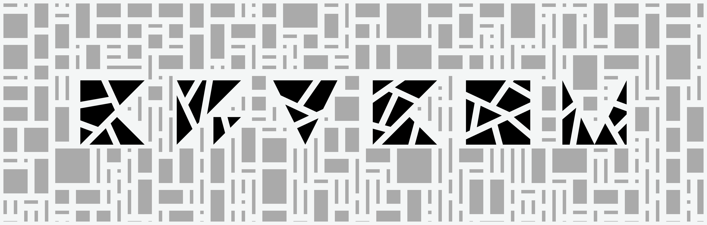

# Markdown Showcase

This document serves as a comprehensive showcase of the standard supported Markdown elements, styling rules, and layout structures available in this theme.

> [!NOTE]
> For Dokfx-specific markdown extensions and styling configurations, please refer to the dedicated feature guides:
>
> * **[Accent Color Customization](accent-color.md)**
> * **[Customizing Callouts](custom-callouts.md)**
> * **[Responsive Images & Sizing](responsive-images.md)**

---

## 1. Typography & Text Formatting

Here is a quick demonstration of basic inline text formatting. Note that the primary brand color used for active elements, hover states, and highlights can be configured globally—see [Accent Color Customization](accent-color.md) for details.

* **Bold text** using `**bold**` or `__bold__`
* *Italic text* using `*italic*` or `_italic_`
* ***Bold and Italic*** using `***bold & italic***`
* ~~Strikethrough text~~ using `~~strikethrough~~`
* `Inline Code Blocks` which are styled with fully rounded side borders and semi-transparent backgrounds to fit seamlessly into text lines.

### Subheadings Demo

#### Level 4 Heading (H4)

##### Level 5 Heading (H5)

###### Level 6 Heading (H6)

---

## 2. Lists

### Unordered List

* Material Design 3 tokens and grids
* Bootstrap 5 layout foundations
* Custom template override system
  * Sub-item A with nested bullets
  * Sub-item B with nested bullets
    * Deeply nested bullet point

### Ordered List

1. Initialize your DocFX project.
2. Configure your `docfx.json` to include the `dokfx` template path.
3. Run the build command to generate files.
    1. Verify output in the `_site` directory.
    2. Check console logs for compilation issues.

### Task List

- [x] Create a custom template stacked on top of `modern`
- [x] Replace definition lists with beautiful responsive tables
- [x] Implement color themes customization (see [Accent Color Customization](accent-color.md))
- [ ] Add support for custom custom-styling search results page

---

## 3. Alerts & Callouts

DocFX supports standard GitHub-flavored markdown alerts to emphasize critical information. In addition
to standard styles, this theme supports custom callout colors—see [Customizing Callouts](custom-callouts.md) for details.

> [!NOTE]
> This is a standard **Note** callout. Use it to provide background context, additional explanations, or helpful tips.

> [!TIP]
> This is a **Tip** callout. Use it to suggest performance optimizations, shortcuts, or best practices.

> [!IMPORTANT]
> This is an **Important** callout. Use it to highlight essential instructions or steps that the user must follow.

> [!WARNING]
> This is a **Warning** callout. Use it to warn the user about breaking changes, potential errors, or configuration hazards.

> [!CAUTION]
> This is a **Caution** callout. Use for high-risk actions that could cause data loss, build failures, or security issues.

---

## 4. Tables

Below is an auto-sized table styled with a Bootstrap striped and bordered design. Under our styling, tables wrap tightly
to their content and do not expand to 100% width unless they overflow the container width.

| Feature | Support Status | Description |
| :--- | :---: | :--- |
| **Material 3 Palette** | Supported | Adapts dynamically to light and dark modes. |
| **Responsive Sidebar** | Supported | Collapses to offcanvas drawer on tablet/mobile views. |
| **Pill-shaped Code** | Supported | Inline code is capsule-shaped and semi-transparent. |
| **Card Tables** | Supported | Tables are rounded and elevated. |

---

## 5. Code Blocks

### Inline Code in Sentence

To configure the template, append your custom template path inside the `"template"` array within your `docfx.json`
configuration file, ensuring it is ordered after `"modern"`.

### Syntax Highlighted Code Blocks

#### C# Example

```csharp
using System;

namespace MyLibrary
{
    /// <summary>
    /// Represents a sample calculator.
    /// </summary>
    public class Calculator
    {
        public int Add(int a, int b)
        {
            // Return sum of inputs
            return a + b;
        }
    }
}
```

#### CSS Override Example

```css
/* Custom CSS override for active links */
.toc li.active > a {
  color: var(--md-primary) !important;
  font-weight: 600;
}
```

---

## 6. Blockquotes

> "Simplicity is the ultimate sophistication."
> — *Leonardo da Vinci*

> Blockquotes can also be nested:
>
> > This is a nested blockquote level.
>
> Back to the first level blockquote.

---

## 7. Links and Images

### Links

* **External Link**: Learn more on the [Official DocFX Website](https://dotnet.github.io/docfx/).
* **Auto-Linked URL**: https://dotnet.github.io/docfx/

### Images

By default, images adapt to fill their parent container width. You can also specify exact dimensions or use
theme-responsive images (supporting automatic light/dark mode versions)—see
[Responsive Images & Sizing](responsive-images.md) for usage instructions.


