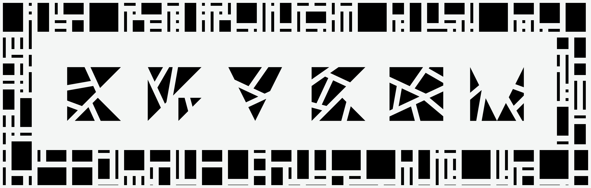
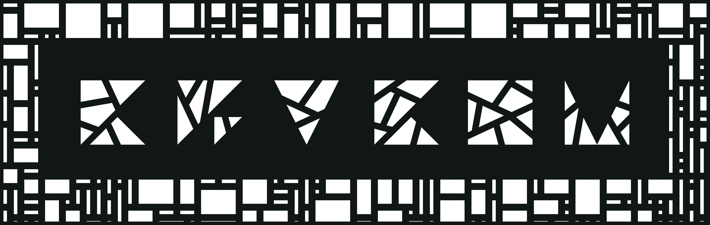
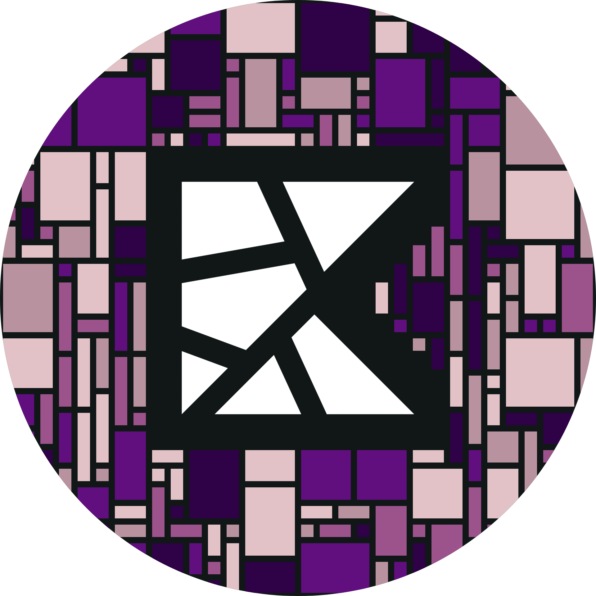

# Responsive Images & Sizing

Dokfx provides powerful custom markdown extensions to create theme-responsive images and control image dimensions directly within your Markdown files.

## 1. Theme-Responsive Images

Theme-responsive images display different image assets depending on whether the user is viewing the site in light or dark mode.

### Markdown Syntax Method
Use the custom responsive image syntax:

```md
?[alt-text](light-theme-image-url)(dark-theme-image-url)
```

For example:

```md
?[KryKom Logo](../images/KRYKOM-oneline-masked-b.png)(../images/KRYKOM-oneline-masked-w.png)
```

This renders as:

?[KryKom Logo](../images/KRYKOM-oneline-masked-b.png)(../images/KRYKOM-oneline-masked-w.png)

This automatically renders the light-themed asset in light mode and the dark-themed asset in dark mode.

### HTML Utility Classes Method
Alternatively, you can use the built-in helper classes `.light-theme-only` and `.dark-theme-only` on standard HTML `` elements:

```html
<!-- Displays on Light Theme -->


<!-- Displays on Dark Theme -->

```

---

## 2. Image Sizing

You can specify image dimensions (width/height) using the custom curly brace attribute syntax immediately following the image element:

```md
{width=<width> height=<height>}
```

For example:

```md
{width=150px}
```

This renders as:

{width=150px}

### Image Sizing with Responsive Images
The sizing syntax also works seamlessly with theme responsive images:

```md
?[alt-text](light-url)(dark-url){width=<width>}
```

For example:

```md
?[KryKom Logo](../images/KRYKOM-oneline-masked-b.png)(../images/KRYKOM-oneline-masked-w.png){width=200px}
```

This renders as:

?[KryKom Logo](../images/KRYKOM-oneline-masked-b.png)(../images/KRYKOM-oneline-masked-w.png){width=200px}
